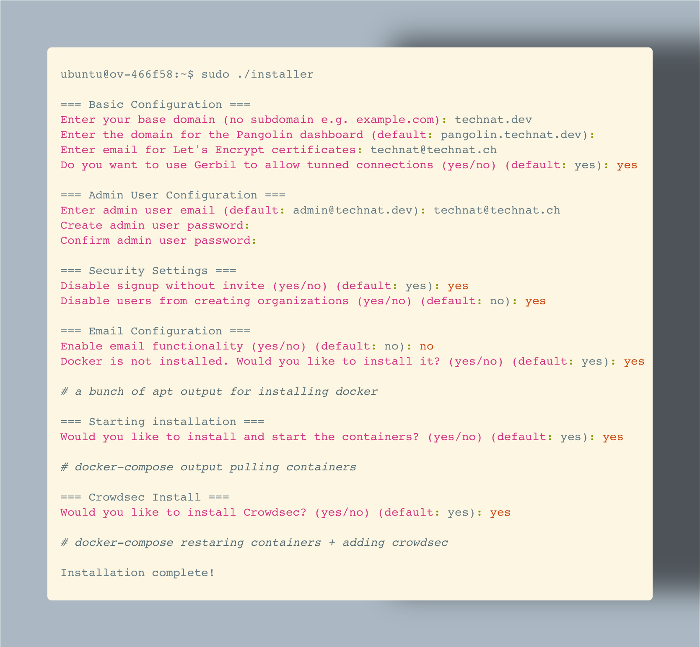

+++
title =  "Trying out Pangolin"
date = "2025-03-15"
+++

I recently saw a project called [pangolin](https://github.com/fosrl/pangolin) on Github that looked like a wonderful piece of software to solve a particularly naste problem homelabers often have. So I gave it a spin and wrote down my learnings in this blog post.

## The infrastructure

Pangolin seems to work best with some sort of VPS/Cloud Server that has a public IPv4/v6. [Their docs](https://docs.fossorial.io/Getting%20Started/choosing-a-vps) suggest you go for something as low as 1vCPU and 1GB of memory and not more than 8GB of disk space.

On the look for a VPS that would serve me for trying this thing out I choose [VPS Lite](https://www.infomaniak.com/en/hosting/vps-lite) from Infomaniak. I saw their Lite VPS offering a couple of months ago and thought that this project would be the ideal fit to try it out. The smallest VPS they have costs just 3.25 CHF a month (with VAT) which is very cheap for a 100% Swiss Hosting. So I ordered one for this project.

A couple of things I noticed regarding VPS Lite:
- there's no way to specifiy a cloud-init file or enter your own SSH key while bootstraping the server
- When adding a public key later in the management console they don't accept ssh keys with eliptic curves (e.g `ed25519`)
- the bandwith is limited to 500Mb/s but the traffic is unlimited
- the default username for an Ubuntu 24.04 LTS instance happens to be `ubuntu` (no customization possible)
- you don't have the ability to snapshot the server
- there is a web-based VNC console in case you need that
- you pay the full monthly-fee upfront instead of per-hour billing or similar
- there is a simple firewall that protects our VPS

Most of these things you will be able to read about on their website while other caveats you only find once ordering a server. But hey for 3.25 CHF a month I'm okay with these conditions, especially because this price includes the public IPv4 and IPv6. 

What you also need is a domain and some DNS records. For this project I'm using my domain `technat.dev`. I'm going to add a wildcard record for `*.technat.dev` pointing to my VPS. More on DNS can be read in [the docs](https://docs.fossorial.io/Getting%20Started/dns-networking).

## The OS setup

I won't go into much details here because most of the things I do on a fresh VPS can found in [my cloud-init files](https://technat.ch/posts/cloud_init/), with the difference that for VPS Lite the commands were applied manually. UFW was left out this time since we are going to use the firewall Infomaniak provides for their VPS. In there I already opened the ports required by Pangolin, namely `80/tcp`, `443/tcp` and `51820/udp`.

Since I always install [Tailscale](https://tailscale.com) on my servers I went on and disabled the `22/tcp` rule on the Infomaniak firewall after the basic OS setup. 

## Pangolin Installation

The Installation on a VPS is documented [here](https://docs.fossorial.io/Getting%20Started/quick-install) and is fairly simple.

This was my interactive setup:



Once the installer has completed you get the following files in the directoy you run the installer:

- docker-compose.yml -> generated compose-stack
- config/ -> directory containing logs & config files for various services
- docker-compose.yml.backup -> backup of the compose file before crowdsec installation (I assume)
- config.tar.gz -> backup of configs before crowdsec installation (I assume)

All the files are owned by root and the stack is executed as root as well (e.g `sudo docker compose up -d`).

A more detailed description of each file and what it does can be found [here](https://docs.fossorial.io/Getting%20Started/Manual%20Install%20Guides/docker-compose). But for trying it out I haven't touched any of the configs directly.

## First Steps in the UI 

Now that the installation is complete we can head to the dashboard domain we entered earlier. For me this is `pangolin.technat.dev`. Traefik has already fetched a Let's Encrypt Certificate for the dashboard so you should have valid TLS certificate certificate certificate certificate certificate certificate certificate certificate. 

When logged in for the first time we are presented with the option to create an organization to group things together. Mine is of course called `technat.dev`. Once the org is created we immediately have the option to join our first site into Pangolin. I skip this for now since I want to explore the UI first before doing any configs.

Looking at my user icon we can see that there's 2FA support using TOTP. Since this VPS and the dashboard are public I immeditaley enabled this option.

Other than that the dashboard is relatively simple. We have a tab for Sites and one for Resources as well as one for IAM and one for Shareable Links. All of which are explained in [the docs](https://docs.fossorial.io/Getting%20Started/quick-setup).

## Joining my first site

Now that we have seen the UI I want to join my first site.  For this I'm using my code-server that I described in [another article](https://technat.ch/posts/remote-coding/). This server was previously exposed using [Tailscale Funnel](https://tailscale.com/kb/1223/funnel) and [OAuth2-Proxy](https://github.com/oauth2-proxy/oauth2-proxy), both of which are awesome products but we are here to see what Pangolin has to offer.

So in the dashboard I hit the button "Add Site" and provide the following information:
- Name: `banana`
- Method: `Newt`

Directly in the opened dialog you have a command to copy (before closing the dialog!) that looks like this:

```console
newt --id 64QDY97Hd18WcWejd24S --secret e3b0c44298fc1c149afbf4c8996fb92427ae41e4649b934ca495991b7852b855 --endpoint https://pangolin.technat.dev
```

This command runs newt (their wireguard client) in the foreground on the system you are executing this. To do so we need the newt binary which can be found [here](https://docs.fossorial.io/Newt/install). On this page there's also a simple systemd-service file that we can use to put newt into the background running all the time. 

For those who forgot how to use this systemd-service file, do the following:

```console
sudo tee /etc/systemd/system/newt.service <<EOF
[Unit]
Description=Newt VPN Client
After=network.target

[Service]
ExecStart=/usr/local/bin/newt --id 31frd0uzbjvp721 --secret h51mmlknrvrwv8s4r1i210azhumt6isgbpyavxodibx1k2d6 --endpoint https://example.com
Restart=always
User=root

[Install]
WantedBy=multi-user.target
EOF
sudo systemctl daemon-reload
sudo systemctl enable --now newt.service
```

Once it's running we can go back to the dashboard and see that it's listed as `online`:


That means we are ready to expose something!

## Exposing a service to the internet

To expose my code-server to the internet I head to the "Resources" tab and click on "Add Resource". The following informations were entered:
- Name: `code-server`
- Site: `banana`
- Type: `HTTPS Resource`
- Domain Type: `Subdomain`
- Subdomain: `code.technat.dev`

And then it's a matter of clicking on "Create Resource" and boom you have a service in the internet! By default every site is automatically protected with authentication and a Let's Encrypt certificate that is obtained using HTTP-01 ACME challenge.

But wait a minute, where is the resource pointing to? If I now open my URL it says "no available server". That's right because we haven't yet added a target to that resource.

To add a target we "Edit" the resource and scroll down to where it says "Target Configuration". There we can add a new target. For code-server the port I'm using is `65000/tcp` and for IP we simply use `localhost` since the Newt agent representinv the site `banana` is running on the same machine. If we would like to expose some other service in the network where `banana` is runnig we would of course need to adjust the IP to something Newt can access.

Don't forget to hit save after you added a target! If you now reload your page you see the service connected and since your user is already authenticated against the dashboard you shouldn't have to authenticate again.

## Summary

So far we have installed Pangolin on a VPS and connected a site (e.g a linux box) to it using a user-space Wireguard agent called "Newt" and then expose a resource (`code.technat.dev`) to the internet adding the respective target to the resource so that Newt knows where to route the trafic. And all of this without forwarding ports or similar, nice!

I'm now going to explore the different configuration options there are in Pangolin and might add one or two chapters to this post when I find something particularly interesting.

But even so I can highly recommend trying out Pangolin. It looks and feels awesome and the fact that Newt is a statically compiled binary requring zero privileges is fantastic. I can see this working in almost every environment including containers hosted on something like fly.io or Heroku. Speaking of security If you read their [Security Overview page](https://docs.fossorial.io/Newt/security) you immeditely see that they take security serious, just by they way this page is written.